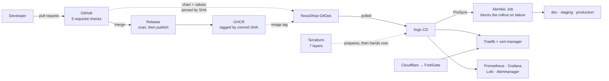

# NovaShop

[](https://github.com/nguyenlpn2015/NovaShop/actions/workflows/ci.yml)
[](https://github.com/nguyenlpn2015/NovaShop/actions/workflows/release.yml)
[](https://github.com/nguyenlpn2015/NovaShop/releases/latest)
[](LICENSE)
[](docs/AUDIT.md)

A production-style platform engineering project: GitOps delivery, guardrails that block
unsafe releases, observability with runbook-backed alerting, Infrastructure as Code, and
disaster recovery — running on a single Ubuntu node.

The storefront is real -- a catalogue, a cart in Redis, orders written inside a
transaction. It is deliberately modest, because **the platform around it is the subject.**

**v1.0.0**, and `main` is 15 commits past it — the storefront, cart, checkout and admin
landed after the tag. Live at [novashop.smartdev.vn](https://novashop.smartdev.vn) ·
[staging](https://staging.novashop.smartdev.vn) ·
[dev](https://dev.novashop.smartdev.vn) ·
[CHANGELOG](CHANGELOG.md) · [Roadmap](docs/ROADMAP.md)

The last badge is deliberate. This runs on one node with no high availability, and that
bounds everything below it.

## Current state

Measured on the running platform, not aspirational.

| | |
|---|---|
| Argo CD Applications | **12 / 12** Synced and Healthy |
| Storefront pages | **8**, on three published environments plus local |
| Prometheus scrape targets | **31 / 31** up |
| Alert rules, each with a runbook | **14**, all verified to resolve to a real file |
| Automated pre-merge checks | **94** across three gates (39 · 30 · 25) |
| Architecture Decision Records | **15**, each with rejected alternatives |
| Architecture views | **13**, all Mermaid, all diffable |
| Terraform layers | **7**, `fmt` clean, all validate |
| TLS | Let's Encrypt, HSTS enforced, renewal monitored |

## Start here

| If you have… | Read |
|---|---|
| **5 minutes** | This page, then [Architecture Overview](docs/architecture/overview.md) |
| **One hour, everything** | [The Complete Guide](docs/THE_COMPLETE_GUIDE.md) — the whole platform in one file |
| **15 minutes** | Add [Repository Audit](docs/AUDIT.md) — the honest scoring |
| **You are interviewing me** | [Interview Guide](docs/INTERVIEW_GUIDE.md) — a walkthrough and the questions I expect |
| **You are preparing to be interviewed** | [docs/interview/](docs/interview/) — teaching guide, 107 questions, cheat sheets |
| **You want to learn this stack** | [NovaShop Academy](docs/academy/) — 19 modules taught from these files; 4 written so far |
| **You want to run it** | [Local Development](docs/operations/local-development.md) |
| **You want to judge the engineering** | [Engineering Log](docs/LEARNING_LOG.md) — the defects found, and how |

## Quick start

Three paths, shortest first. None of them needs access to the live platform.

**Run the application** — about two minutes.

```sh
git clone https://github.com/nguyenlpn2015/NovaShop.git && cd NovaShop
cp .env.example .env
docker compose up --build
```

Frontend on [localhost:3000](http://localhost:3000), API docs on
[localhost:8000/docs](http://localhost:8000/docs). This is Compose, not Kubernetes — no Argo
CD, no TLS, no observability, and that is
[a decision rather than a gap](docs/operations/local-development.md#what-local-development-is-not).

**Check the platform is what this page claims** — about five minutes, no cluster, no
credentials. See [Verify any claim](#verify-any-claim-on-this-page) below.

**Deploy it on a node of your own** — a few hours, one Ubuntu 22.04 host.
[Production Deployment](docs/operations/production-deployment.md) is the full sequence;
[Bootstrap Flow](docs/architecture/bootstrap-flow.md) is the same thing as a diagram.

## What this demonstrates

**GitOps that is enforced, not aspirational.** Two repositories. Every reference from
desired state to source is a 40-character commit SHA, verified to be an ancestor of `main`
and to correspond to images that exist in the registry. A gate refuses anything else.

**Release safety by structure, not by condition.** An image cannot reach the registry unless
its scan passed — the build loads locally, Trivy scans, and only then does the workflow
acquire registry credentials. Release cannot race CI because both are nodes in one job graph,
not two workflow runs observing each other.

**Observability designed against silent failure.** A scrape job whose relabel rules match
nothing renders, validates, deploys, and collects nothing — indistinguishable from a healthy
system. Every required job is asserted by name, Traefik's discovery role is asserted
explicitly, and every alert expression was evaluated against live data before merge.

**Security that was proven, not assumed.** Pod Security Admission enforces `restricted` and
genuinely rejects non-compliant pods. Containers run non-root with `readOnlyRootFilesystem`
and all capabilities dropped. Default-deny ingress was trialled on a live namespace with a
control group before it was committed.

**Recovery treated as a capability, not a document.** Certificate material is restored before
Argo CD reconciles, because otherwise cert-manager spends one of five Let's Encrypt
issuances per week. The recovery script is exercised, not just reviewed — which is how we
found it could not run at all.

## Architecture



Thirteen views with the reasoning behind each: **[docs/architecture/](docs/architecture/)**

## Seeing it run

The platform is live, so the fastest evidence is the platform itself rather than a picture of
it:

| | |
|---|---|
| Storefront | [novashop.smartdev.vn](https://novashop.smartdev.vn) — HSTS, Let's Encrypt |
| Catalogue | [/products](https://novashop.smartdev.vn/products) — 128 products, filtering, sorting, pagination |
| Cart | [/cart](https://novashop.smartdev.vn/cart) — held in Redis, survives a pod restart |
| Orders · Admin | [/orders](https://novashop.smartdev.vn/orders) · [/admin](https://novashop.smartdev.vn/admin) — aggregates, cached 60s |
| Staging · Development | [staging](https://staging.novashop.smartdev.vn) · [dev](https://dev.novashop.smartdev.vn) — same chart, different values |
| Backend, on its own host | [/health](https://api.novashop.smartdev.vn/health) · [/live](https://api.novashop.smartdev.vn/live) · [/ready](https://api.novashop.smartdev.vn/ready) |

`/live` returns healthy while `/ready` reports its dependencies, which is why there are three
endpoints rather than one — [ADR-backed reasoning](docs/architecture/overview.md).

Argo CD and Grafana are not exposed publicly — they hold cluster state and there is no SSO in
front of them. [Screenshots](docs/screenshots/) is where captures of those consoles belong,
and it currently holds the capture procedure rather than the images.

## Stack

| Layer | Choice | Why |
|---|---|---|
| Kubernetes | k3s v1.33.13, single node, SQLite | [ADR 002](adr/002-kubernetes-distribution.md) |
| Delivery | GitOps, two repositories | [ADR 003](adr/003-gitops-delivery.md) |
| Controller | Argo CD v3.4.4 | [ADR 005](adr/005-gitops-controller.md) |
| Packaging | Helm for installs, Kustomize for composition | [ADR 006](adr/006-helm-and-kustomize.md) |
| Edge | Traefik 3.7.4, cert-manager v1.21.0 | [ADR 007](adr/007-ingress-controller.md) |
| CI | GitHub Actions, reusable workflow | [ADR 008](adr/008-ci-platform.md) |
| Metrics and logs | Prometheus, Grafana, Loki, Alloy | [ADR 009](adr/009-observability-stack.md) · [ADR 004](adr/004-log-collection-agent.md) |
| Secrets | Created outside Git, by procedure | [ADR 010](adr/010-secret-management.md) |
| IaC | Terraform, 7 layers, non-cloud | [ADR 012](adr/012-terraform-scope.md) |
| Application | FastAPI, SQLAlchemy 2, Alembic | — |
| Storefront | Next.js 15 App Router, Tailwind, server-side rendering | — |
| Schema migration | Alembic, run as an Argo CD **PreSync** hook | — |

## What is deliberately absent

Saying no is part of the design. Each has a recorded reason.

| Not here | Why |
|---|---|
| Distributed tracing | **Deferred on capacity, not on value.** Two of the three conditions [ADR 011](adr/011-distributed-tracing.md) set for revisiting are now met — checkout spans Redis and PostgreSQL, and every page is a two-service call. The node is at ~150% committed memory; Tempo would displace the observability already running |
| High availability | One node. Every document says so rather than implying redundancy. |
| Service mesh, Kyverno, Vault | Pod Security Admission and RBAC already cover what these would add here |
| Alert routing | Needs a credential this repository does not hold and an on-call decision |

## Honest assessment

[docs/AUDIT.md](docs/AUDIT.md) scores seven dimensions with the commands to falsify each.
The weakest are stated plainly:

- **Reliability 3/5** — 52 backend and 17 frontend tests, no coverage measurement, and no
  load testing. The frontend gap the audit named is closed; the measurement gap is not
- **Production Readiness 2/5** — one node, no HA, alerts route nowhere
- **Recovery is documented, not demonstrated.** Every component is tested — preconditions
  pass, a database restore round-trips 137 rows with an identical checksum, a deleted Service
  is reconciled in 5 seconds — but the full sequence has never run on a replacement node.
  **RTO is an estimate of 30–45 minutes and should be treated as unknown.**

A platform whose own audit is flattering is not an audit.

## Repository layout

```
adr/                    15 decision records
backend/                FastAPI + hand-written Prometheus instrumentation
frontend/               Next.js
helm/novashop/          The application chart
kubernetes/             Platform component values, ingress phases, cert-manager
terraform/              7 layers, non-cloud IaC
argocd/                 Bootstrap manifests and the pinned Argo CD digest
scripts/                Bootstrap, validation gates, backup, restore, recovery
runbooks/               An index; the runbooks live beside the alerts they serve
docs/                   93 documents — architecture, operations, runbooks, audits, academy
diagrams/               Subsystem diagrams predating docs/architecture/
.github/                CI, release, validation workflow, rulesets as JSON
```

Desired state lives in a second repository:
[NovaShop-GitOps](https://github.com/nguyenlpn2015/NovaShop-GitOps).

## Verify any claim on this page

```sh
git clone https://github.com/nguyenlpn2015/NovaShop.git
git clone https://github.com/nguyenlpn2015/NovaShop-GitOps.git
cd NovaShop

bash scripts/validate-platform.sh          --gitops-dir ../NovaShop-GitOps   # 39 checks
bash scripts/validate-gitops-revisions.sh  --gitops-dir ../NovaShop-GitOps   # 30 checks
bash scripts/validate-observability.sh     --gitops-dir ../NovaShop-GitOps   # 25 checks

docker run --rm -v "$PWD:/repo" -w /repo hashicorp/terraform:1.9.8 \
  fmt -check -recursive terraform
```

All three run without a cluster and without credentials.

## Documentation

[docs/README.md](docs/README.md) is the index. The most useful entry points:

- [Architecture](docs/architecture/) — 13 views
- [Operations](docs/operations/) — deployment, troubleshooting, upgrade, backup, observability
- [Runbooks](docs/observability/runbooks/) — one per alert, 14 of them
- [ADRs](adr/) — why each technology, and what lost
- [Audit](docs/AUDIT.md) · [Terraform audit](docs/TERRAFORM_AUDIT.md)
- [Roadmap](docs/ROADMAP.md) — delivered, next, and deliberately out of scope
- [Release checklist](docs/RELEASE_CHECKLIST.md) — what is verified before a tag

## Contributing

Pull requests are welcome, including ones that argue against a decision recorded here.

- **[CONTRIBUTING.md](CONTRIBUTING.md)** — workflow, required checks, and where to start
- The three gates run in minutes with no cluster and no credentials; they are the fastest way
  to learn what this platform considers correct
- The most useful contributions right now: a document that is wrong, coverage measurement
  for either side, or one of the fifteen unwritten [Academy](docs/academy/) modules
- Report a vulnerability privately through
  [Security advisories](https://github.com/nguyenlpn2015/NovaShop/security/advisories/new),
  never a public issue — [SECURITY.md](SECURITY.md)

[MIT](LICENSE) · [CODE_OF_CONDUCT.md](CODE_OF_CONDUCT.md)
