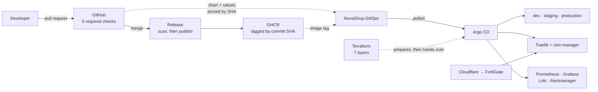

# NovaShop

A production-style platform engineering project: GitOps delivery, guardrails that block
unsafe releases, observability with runbook-backed alerting, Infrastructure as Code, and
disaster recovery — running on a single Ubuntu node.

The application is deliberately small. **The platform around it is the subject.**

Live at [novashop.smartdev.vn](https://novashop.smartdev.vn) ·
[staging](https://staging.novashop.smartdev.vn) ·
[dev](https://dev.novashop.smartdev.vn)

## Current state

Measured on the running platform, not aspirational.

| | |
|---|---|
| Argo CD Applications | **12 / 12** Synced and Healthy |
| Prometheus scrape targets | **31 / 31** up |
| Alert rules, each with a runbook | **14**, all verified to resolve to a real file |
| Automated pre-merge checks | **93** across three gates |
| Architecture Decision Records | **15**, each with rejected alternatives |
| Architecture views | **13**, all Mermaid, all diffable |
| Terraform layers | **7**, `fmt` clean, all validate |
| TLS | Let's Encrypt, HSTS enforced, renewal monitored |

## Start here

| If you have… | Read |
|---|---|
| **5 minutes** | This page, then [Architecture Overview](docs/architecture/overview.md) |
| **15 minutes** | Add [Repository Audit](docs/AUDIT.md) — the honest scoring |
| **You are interviewing me** | [Interview Guide](docs/INTERVIEW_GUIDE.md) — a walkthrough and the questions I expect |
| **You want to run it** | [Local Development](docs/operations/local-development.md) |
| **You want to judge the engineering** | [Engineering Log](docs/LEARNING_LOG.md) — the defects found, and how |

## What this demonstrates

**GitOps that is enforced, not aspirational.** Two repositories. Every reference from
desired state to source is a 40-character commit SHA, verified to be an ancestor of `main`
and to correspond to images that exist in the registry. A gate refuses anything else.

**Release safety by structure, not by condition.** An image cannot reach the registry unless
its scan passed — the build loads locally, Trivy scans, and only then does the workflow
acquire registry credentials. Release cannot race CI because both are nodes in one job graph,
not two workflow runs observing each other.

**Observability designed against silent failure.** A scrape job whose relabel rules match
nothing renders, validates, deploys, and collects nothing — indistinguishable from a healthy
system. Every required job is asserted by name, Traefik's discovery role is asserted
explicitly, and every alert expression was evaluated against live data before merge.

**Security that was proven, not assumed.** Pod Security Admission enforces `restricted` and
genuinely rejects non-compliant pods. Containers run non-root with `readOnlyRootFilesystem`
and all capabilities dropped. Default-deny ingress was trialled on a live namespace with a
control group before it was committed.

**Recovery treated as a capability, not a document.** Certificate material is restored before
Argo CD reconciles, because otherwise cert-manager spends one of five Let's Encrypt
issuances per week. The recovery script is exercised, not just reviewed — which is how we
found it could not run at all.

## Architecture



Thirteen views with the reasoning behind each: **[docs/architecture/](docs/architecture/)**

## Stack

| Layer | Choice | Why |
|---|---|---|
| Kubernetes | k3s v1.33.13, single node, SQLite | [ADR 002](adr/002-kubernetes-distribution.md) |
| Delivery | GitOps, two repositories | [ADR 003](adr/003-gitops-delivery.md) |
| Controller | Argo CD v3.4.4 | [ADR 005](adr/005-gitops-controller.md) |
| Packaging | Helm for installs, Kustomize for composition | [ADR 006](adr/006-helm-and-kustomize.md) |
| Edge | Traefik 3.7.4, cert-manager v1.21.0 | [ADR 007](adr/007-ingress-controller.md) |
| CI | GitHub Actions, reusable workflow | [ADR 008](adr/008-ci-platform.md) |
| Metrics and logs | Prometheus, Grafana, Loki, Alloy | [ADR 009](adr/009-observability-stack.md) · [ADR 004](adr/004-log-collection-agent.md) |
| Secrets | Created outside Git, by procedure | [ADR 010](adr/010-secret-management.md) |
| IaC | Terraform, 7 layers, non-cloud | [ADR 012](adr/012-terraform-scope.md) |
| Application | FastAPI, Next.js, PostgreSQL 14, Redis | — |

## What is deliberately absent

Saying no is part of the design. Each has a recorded reason.

| Not here | Why |
|---|---|
| Distributed tracing | The backend has no business endpoints; a trace would be `GET /ready` plus two dependency calls — [ADR 011](adr/011-distributed-tracing.md) |
| High availability | One node. Every document says so rather than implying redundancy. |
| Service mesh, Kyverno, Vault | Pod Security Admission and RBAC already cover what these would add here |
| Alert routing | Needs a credential this repository does not hold and an on-call decision |

## Honest assessment

[docs/AUDIT.md](docs/AUDIT.md) scores seven dimensions with the commands to falsify each.
The weakest are stated plainly:

- **Reliability 3/5** — 9 backend tests, **0 frontend tests**, no coverage measurement
- **Production Readiness 2/5** — one node, no HA, alerts route nowhere
- **Recovery** — the full sequence has never been exercised on a replacement node

A platform whose own audit is flattering is not an audit.

## Repository layout

```
adr/                    15 decision records
backend/                FastAPI + hand-written Prometheus instrumentation
frontend/               Next.js
helm/novashop/          The application chart
kubernetes/             Platform component values, ingress baselines, cert-manager
terraform/              7 layers, non-cloud IaC
argocd/                 Bootstrap manifests and the pinned Argo CD digest
scripts/                Bootstrap, validation gates, backup, restore, recovery
docs/                   117 documents — architecture, operations, runbooks, audits
diagrams/               Subsystem diagrams predating docs/architecture/
.github/                CI, release, validation workflow, rulesets as JSON
```

Desired state lives in a second repository:
[NovaShop-GitOps](https://github.com/nguyenlpn2015/NovaShop-GitOps).

## Verify any claim on this page

```sh
git clone https://github.com/nguyenlpn2015/NovaShop.git
git clone https://github.com/nguyenlpn2015/NovaShop-GitOps.git
cd NovaShop

bash scripts/validate-platform.sh          --gitops-dir ../NovaShop-GitOps   # 38 checks
bash scripts/validate-gitops-revisions.sh  --gitops-dir ../NovaShop-GitOps   # 30 checks
bash scripts/validate-observability.sh     --gitops-dir ../NovaShop-GitOps   # 25 checks

docker run --rm -v "$PWD:/repo" -w /repo hashicorp/terraform:1.9.8 \
  fmt -check -recursive terraform
```

All three run without a cluster and without credentials.

## Documentation

[docs/README.md](docs/README.md) is the index. The most useful entry points:

- [Architecture](docs/architecture/) — 13 views
- [Operations](docs/operations/) — deployment, troubleshooting, upgrade, backup, observability
- [Runbooks](docs/observability/runbooks/) — one per alert, 14 of them
- [ADRs](adr/) — why each technology, and what lost
- [Audit](docs/AUDIT.md) · [Terraform audit](docs/TERRAFORM_AUDIT.md)

## Licence and contributing

[MIT](LICENSE) · [CONTRIBUTING.md](CONTRIBUTING.md) · [SECURITY.md](SECURITY.md) ·
[CODE_OF_CONDUCT.md](CODE_OF_CONDUCT.md)
