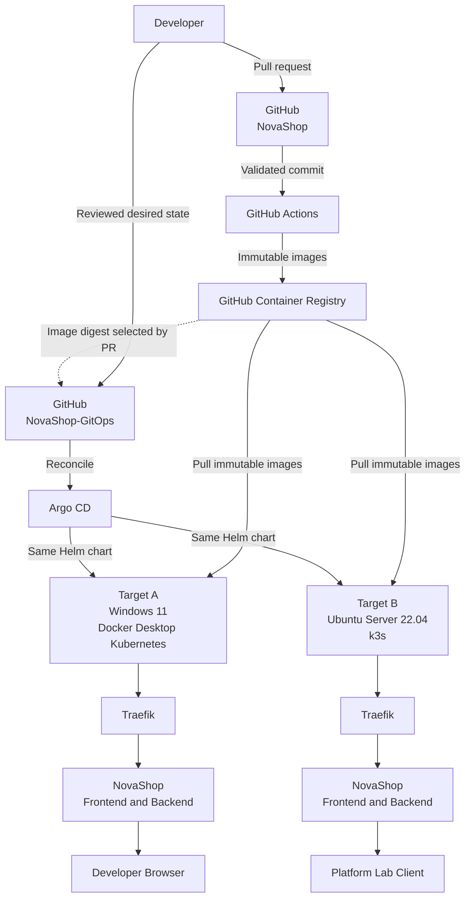

# GitOps Runtime

```mermaid
flowchart TD
    developer[Developer]
    github[GitHub<br/>NovaShop]
    actions[GitHub Actions]
    ghcr[GitHub Container Registry]
    gitops[GitHub<br/>NovaShop-GitOps]
    argocd[Argo CD]
    targetA[Target A<br/>Windows 11<br/>Docker Desktop Kubernetes]
    targetB[Target B<br/>Ubuntu Server 22.04<br/>k3s]
    traefikA[Traefik]
    traefikB[Traefik]
    novashopA[NovaShop<br/>Frontend and Backend]
    novashopB[NovaShop<br/>Frontend and Backend]
    browserA[Developer Browser]
    browserB[Platform Lab Client]

    developer -->|Pull request| github
    github -->|Validated commit| actions
    actions -->|Immutable images| ghcr
    ghcr -.->|Image digest selected by PR| gitops
    developer -->|Reviewed desired state| gitops
    gitops -->|Reconcile| argocd
    argocd -->|Same Helm chart| targetA
    argocd -->|Same Helm chart| targetB
    ghcr -->|Pull immutable images| targetA
    ghcr -->|Pull immutable images| targetB
    targetA --> traefikA --> novashopA --> browserA
    targetB --> traefikB --> novashopB --> browserB
```
