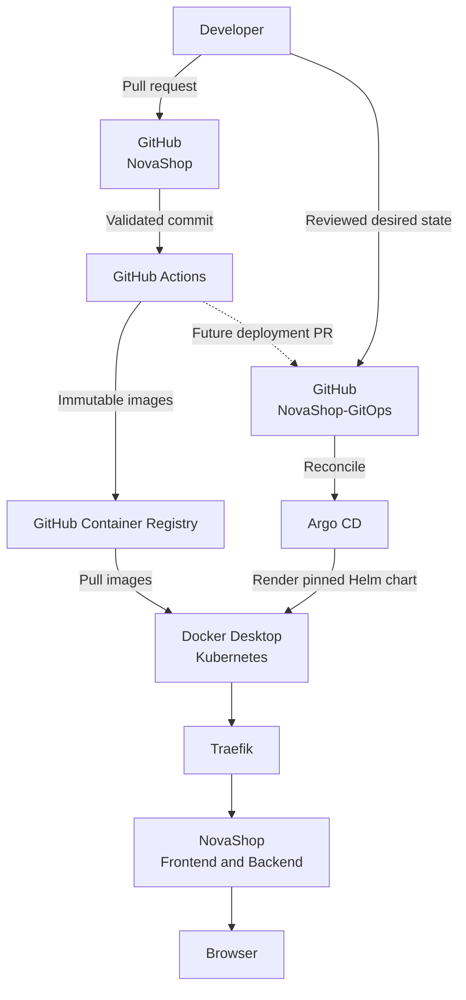

# GitOps Runtime

```mermaid
flowchart TD
    developer[Developer]
    github[GitHub<br/>NovaShop]
    actions[GitHub Actions]
    ghcr[GitHub Container Registry]
    gitops[GitHub<br/>NovaShop-GitOps]
    argocd[Argo CD]
    kubernetes[Docker Desktop<br/>Kubernetes]
    traefik[Traefik]
    novashop[NovaShop<br/>Frontend and Backend]
    browser[Browser]

    developer -->|Pull request| github
    github -->|Validated commit| actions
    actions -->|Immutable images| ghcr
    actions -.->|Future deployment PR| gitops
    developer -->|Reviewed desired state| gitops
    gitops -->|Reconcile| argocd
    argocd -->|Render pinned Helm chart| kubernetes
    ghcr -->|Pull images| kubernetes
    kubernetes --> traefik
    traefik --> novashop
    novashop --> browser
```
