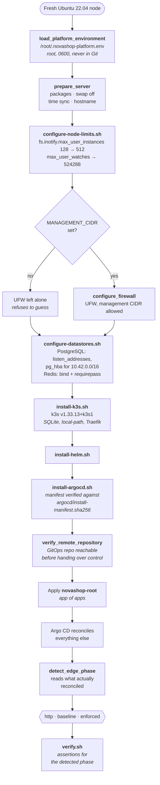

# Bootstrap Flow

How an empty Ubuntu machine becomes this platform, and why every step can be run
twice.



## Idempotence is the requirement, not a bonus

The brief was that bootstrap must be rerun-safe on a clean VM, during disaster
recovery, and after a node rebuild. That rules out any step that assumes it is
running for the first time.

The pattern used throughout is a **marked managed block**. `configure-datastores.sh`
writes its PostgreSQL and Redis configuration between sentinel comments, compares
the desired block against what is on disk, and restarts the service **only when the
content actually changed**. Rerunning it on a configured node changes nothing and
restarts nothing — which is what makes it safe to run during an incident.

`configure-node-limits.sh` follows the same shape for `/etc/sysctl.d`, and verifies
the limit afterwards rather than trusting that writing the file worked.

## The Argo CD manifest is verified before it is applied

`install-argocd.sh` checks the downloaded install manifest against a SHA-256 recorded
in `argocd/install-manifest.sha256`:

```
b0f9119821f2e19b852c842b9cb235eb9c3ef1549554fbda6aa5904e8d440eae
```

Bootstrap pulls a large YAML file over the network and applies it with cluster-admin.
Pinning a version is not enough — a version is a mutable pointer at a URL. The digest
makes substitution detectable.

## Reachability is checked before control is handed over

`verify_remote_repository` confirms the GitOps repository is reachable **before** the
root Application is applied. Applying it against an unreachable repository leaves
Argo CD installed, in charge, and unable to render anything — a state that looks like
a cluster problem and is a network problem.

## The edge phase is detected, never assumed

`scripts/lib/edge-phase.sh` reads what actually reconciled and emits one of
`enforced`, `baseline`, `http`, `none`, or `unknown`. It does this by inspecting the
live Argo CD state, not by reading a variable someone set.

That distinction matters because `verify.sh` asserts different things per phase.
Asserting HSTS in the `http` phase would fail correctly and mean nothing; asserting
only HTTP in the `enforced` phase would pass and prove nothing. A verification script
that is told which phase it is in can be told the wrong one — so it works it out.

## The inotify limit is a correctness fix

Adding the observability stack exhausted `fs.inotify.max_user_instances`. The default
is 128 and the node reached 140: every config reloader, log collector, dashboard
sidecar, and certificate watcher consumes an instance. Traefik reported it plainly:

```
failed to create fsnotify watcher: too many open files
```

That is not cosmetic. A workload that cannot create a watcher keeps running with
whatever it loaded at startup and **silently stops noticing changes** — which on this
platform means a renewed certificate or a synced manifest that never takes effect.
The script raises the limit and tells the operator that anything which already logged
the failure needs a restart, rather than restarting pods underneath them.

## Secrets are created outside Git

Runtime credentials live in `/root/.novashop-platform.env`, owned by root with mode
0600, and are never committed. Two Kubernetes Secrets are created out of band by the
same pattern:

| Secret | Namespace | For |
|---|---|---|
| `novashop-grafana-admin` | `observability` | Grafana admin credentials |
| `novashop-datastore-exporter` | `observability` | PostgreSQL and Redis exporter credentials |

`.gitignore` blocks `tls-*.json`, `acme-*.json`, `runtime-*.json`, and
`platform-state*/` so that captured state cannot be committed by accident. The
reasoning, and what would be required to move to an external secret manager, is in
[ADR 010](../../adr/010-secret-management.md).

## Running it

See the [Production Deployment Guide](../operations/production-deployment.md). The
short version:

```sh
sudo scripts/linux/bootstrap.sh
sudo scripts/linux/verify.sh
```

## Next

[Recovery Flow](recovery-flow.md) — the same machinery, pointed at a disaster.
