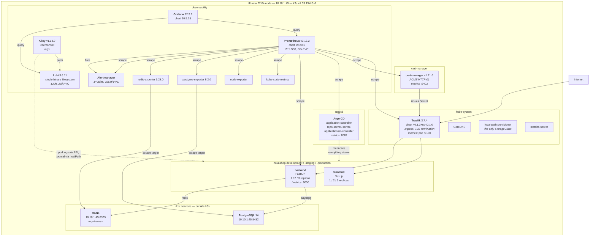

# Container Diagram

C4 level 2. What actually runs inside the boundary, and how the pieces reach each
other. Versions are the versions deployed.

## Reading the boundaries

**Traefik publishes metrics on the pod, not the Service.** Its Service exposes
`web` and `websecure` only. An endpoints-based scrape job would render, validate,
deploy, and collect nothing, so Prometheus discovers Traefik with `role: pod` and a
gate asserts that it still does. This is the single most instructive line in the
scrape configuration.

**The backend's scrape annotation names the container port.** Endpoints-role
discovery connects to the pod IP, so an annotation naming the Service port produces
connection refused on every replica while everything else looks healthy. It did,
once, across six production pods.

**PostgreSQL and Redis are on the host.** Pods reach them at `10.10.1.45` over the
cluster network, which is why `pg_hba.conf` carries a rule for `10.42.0.0/16` and
why `listen_addresses` cannot be loopback only. Both are managed by
`scripts/linux/configure-datastores.sh` inside marked blocks so the script is
idempotent.

**The exporters are least-privilege.** PostgreSQL 14 grants `CREATE` on the `public`
schema to `PUBLIC`, so `pg_monitor` alone let the exporter create tables. That grant
is revoked and given to the application role only. Verified by attempting a write as
the exporter and having it denied.

**Alloy reads pod logs through the Kubernetes API**, not from host paths, so it
needs no hostPath mount for containers and cannot read outside its RBAC. The journal
is the one exception and the reason `varlog` is mounted.

## Replica counts

| Environment | Namespace | frontend | backend |
|---|---|---|---|
| development | `novashop-development` | 1 | 1 |
| staging | `novashop-staging` | 2 | 2 |
| production | `novashop-production` | 3 | 3 |

Three replicas on one node is a demonstration of scaling mechanics, not capacity.
It is also why node memory limits sit near 150% of allocatable, and why
[MemoryHigh](../observability/runbooks/memory-high.md) says to reduce replicas
before raising thresholds.

## The health endpoints, and why there are three

| Endpoint | Consults | Used by |
|---|---|---|
| `/health` | nothing | legacy, retained |
| `/live` | nothing | liveness probe |
| `/ready` | PostgreSQL **and** Redis | readiness probe |

`/live` deliberately checks no dependency. A liveness probe that fails when the
database is unreachable restarts a healthy process and turns a datastore outage into
a crash loop. `/ready` returns 503 instead, so the pod stops receiving traffic and
recovers on its own when the dependency returns — no restart needed, because it
re-checks rather than caching the failure.

## Next

[Deployment Diagram](deployment.md) puts this on hardware.
