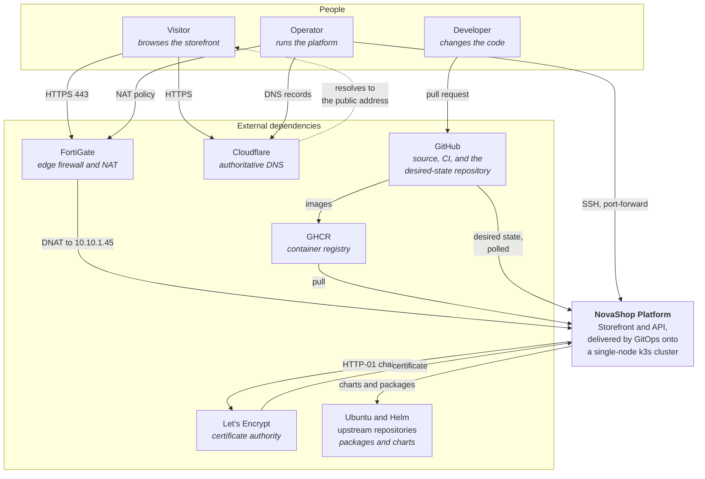

# System Context

C4 level 1. What NovaShop is, who uses it, and what it depends on that it does not
control.

## The three actors

**Visitor.** Reaches the storefront over HTTPS. Never authenticates — the
application has no accounts. This matters for the threat model: there are no user
credentials in the system to leak.

**Operator.** Runs the platform. Has SSH access to the node and administrative
access to Cloudflare and the FortiGate. Every operational procedure in
[docs/operations/](../operations/) is written for this person, and every runbook
assumes they are reading it at an inconvenient hour.

**Developer.** Changes code through pull requests. Cannot deploy directly: the
branch is protected, the checks are required, and the cluster reconciles only what
is committed to the GitOps repository. The path from a developer's intent to running
state has no manual step that bypasses review.

## The six external dependencies

Each one is something the platform needs and does not own. Naming them is the point
of this diagram — an outage in any of them is an outage the platform cannot fix from
inside.

| Dependency | Used for | If it fails |
|---|---|---|
| **GitHub** | Source, CI, and the desired-state repository Argo CD polls | No new deployments. The cluster keeps serving what it last converged to; self-heal continues to work against its cached state. |
| **GHCR** | Container images, tagged by commit SHA | Running pods are unaffected. A new pod on a node with no cached layer cannot start — `ImagePullBackOff`. |
| **Let's Encrypt** | TLS certificates over HTTP-01 | Renewal fails silently. `CertificateExpiring` fires three weeks out, which is the entire reason that alert exists. |
| **Cloudflare** | Authoritative DNS | The site is unreachable by name and HTTP-01 validation fails, so certificates cannot renew either. |
| **FortiGate** | Edge firewall and destination NAT for 80/443 | The site is unreachable from the internet. The cluster is unaffected and still reachable on the LAN. |
| **Ubuntu / Helm upstreams** | Packages during bootstrap, charts during sync | Bootstrap on a fresh node fails. A running cluster is unaffected until it next needs to render a chart. |

## What is inside the boundary

Everything the platform can be held responsible for: k3s, Argo CD, Traefik,
cert-manager, the three application environments, the observability stack, and
PostgreSQL and Redis.

PostgreSQL and Redis deserve a note. They run on the node, outside k3s, and are
reached by pods over the cluster network. They are inside this boundary — the
platform installs, configures, and monitors them — but they are outside the
Kubernetes control plane. That distinction is why
[DatabaseDown](../observability/runbooks/database-down.md) has to distinguish three
failures that look identical from a pod: the service being down, the bind address
being wrong, and authentication failing.

## What is deliberately not here

No CDN, no WAF, no external secret manager, no managed database, no object storage.
Each is a defensible addition and each would be one more thing to explain rather
than one more thing demonstrated. Secrets are created outside Git by documented
procedure; the alternative — an external manager — is discussed in
[ADR 010](../../adr/010-secret-management.md).

## Next

[Container Diagram](c4-container.md) opens the box.
