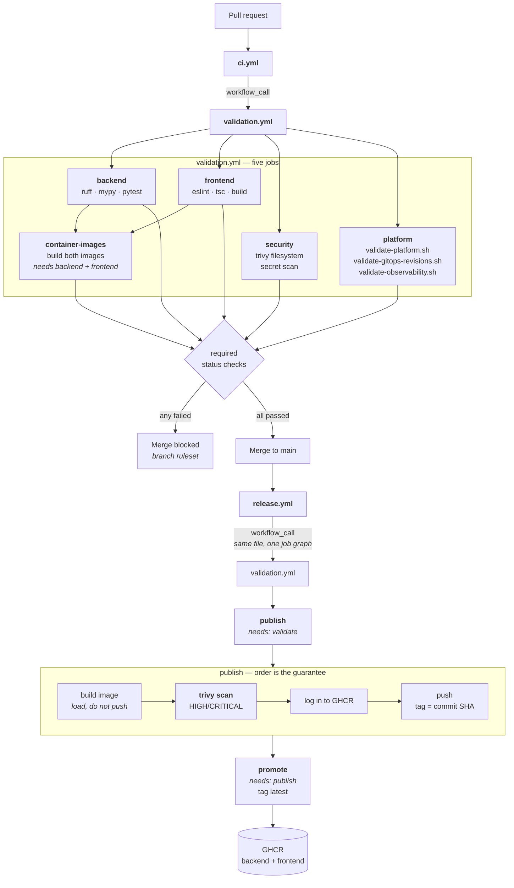

# CI/CD Flow

How code becomes a verified image, and what makes it impossible to publish an
unverified one.



## The three guarantees, and how each is structural

The user requirement was that images must never publish unless CI, the security
scan, and platform validation all passed; that release must never race CI; and that
`latest` must never point at a failed build. Each is enforced by shape rather than by
a condition someone could get wrong.

**Release cannot race CI.** `release.yml` does not wait for `ci.yml` and does not
inspect its result. It calls the same `validation.yml` as a reusable workflow, so
validation and publication are nodes in **one job graph** with `publish` declaring
`needs: validate`. There is no window in which a release could start while validation
is still running, because they are not separate runs.

**An unscanned image cannot reach the registry.** Inside `publish`, the build loads
the image locally, Trivy scans it, and only then does the workflow log in to GHCR and
push. Registry credentials are not even acquired until the scan has passed. Ordering
the steps this way means there is no path — no `continue-on-error`, no `if: always()`
— by which a failing scan is followed by a push.

**`latest` moves only after everything.** Promotion is a separate job with
`needs: publish`, so `latest` is retagged only once both images have been built,
scanned, and pushed. A partial success leaves `latest` pointing where it was.

## `fail-fast: false`, deliberately

The image matrix does not stop at the first failure. With `fail-fast: true`, a
frontend CVE cancelled the backend job, and across three consecutive blocked releases
there was no way to tell whether the backend was clean. Letting both run costs a few
minutes and turns "something failed" into "this failed and that did not".

## Actions are pinned to SHAs

Every third-party action is pinned to a full commit SHA with the human-readable
version in a trailing comment:

```yaml
uses: actions/checkout@3d3c42e5aac5ba805825da76410c181273ba90b1 # v7.0.1
```

A tag is a movable pointer. An action referenced by tag can change under the
workflow, and workflows run with credentials.

## The platform job

The one that catches what unit tests cannot. It checks out both repositories and
runs three gates:

| Gate | Asserts |
|---|---|
| `validate-platform.sh` | yamllint over git-tracked files; every Kustomize overlay builds; every Helm chart renders and lints per environment; kubeconform against a CRD catalogue; ApplicationSet source invariants; runtime version alignment |
| `validate-gitops-revisions.sh` | Every pin is a durable SHA and every referenced image exists in GHCR |
| `validate-observability.sh` | 25 checks: charts render, `promtool check config`, `promtool check rules`, required scrape jobs present by name, Traefik discovered by pod, exporters annotated, Loki lean, every rendered kind whitelisted, every container bounded, every alert has a runbook that exists |

Runtime version alignment deserves a mention: it asserts the Node major version
matches across the frontend `Dockerfile`, the workflow's `NODE_VERSION`,
`engines.node`, and `@types/node`, and the same for Python. These drift silently and
the symptom appears far from the cause.

## Known rough edge

`ci.yml` triggers on both `pull_request` and `push` for working branches, so most
pushes produce two identical runs. It is wasteful and it has caused real confusion —
re-running one while reading the other's stale result. Removing the `push` trigger is
on the [roadmap](../../docs/ROADMAP.md) and not yet done.

## Next

[Bootstrap Flow](bootstrap-flow.md) — how the cluster these images land on is built.
