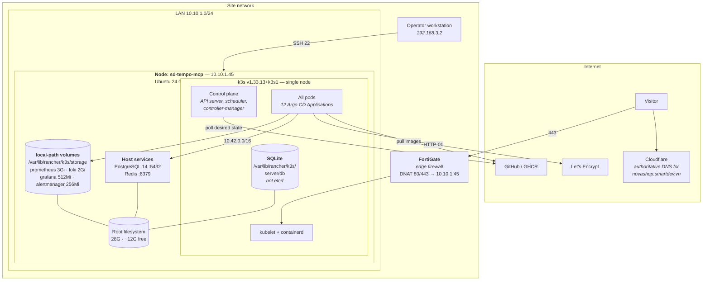

# Deployment Diagram

Where the platform physically runs, and what that costs.

## One node, and what follows from it

This is the central fact about the deployment, and most of the platform's design
follows from it.

**No rescheduling.** There is nowhere for a pod to move. A node fault is a total
outage, which is why recovery is a rehearsed procedure — see
[Recovery Flow](recovery-flow.md) — rather than an assumption about redundancy.

**Everything shares one disk.** The root filesystem holds container images, the k3s
SQLite datastore, PostgreSQL's data, and every `local-path` volume including
Prometheus and Loki. A full disk therefore stops the database *and* the monitoring
that would have told you. [DiskFull](../observability/runbooks/disk-full.md) is
critical for that reason, and
[ObservabilityVolumeFilling](../observability/runbooks/observability-volume-filling.md)
exists because observability failing silently is worse than it failing loudly.

**SQLite, not etcd.** k3s defaults to SQLite on a single server. Backup is a file
copy rather than an etcd snapshot, which makes
[recovery](recovery-flow.md) simpler and the write path a single point of failure.

**One storage class.** `local-path` binds volumes to this node's filesystem, so a
`PersistentVolumeClaim` cannot outlive the node. Anything that must survive is in
the backup; everything else — Prometheus history, Loki chunks, Alertmanager
silences — is explicitly accepted as disposable.

Two silent traps live here. `local-path` writes the bound volume name back into the
claim, which Argo CD would fight forever without an `ignoreDifferences` entry. And
the Helm key is `storageClass` in some charts and `storageClassName` in others —
getting it wrong does not error, it quietly provisions from the default.

## Capacity

Measured, not estimated. Overcommit is intentional and monitored.

| Resource | Requests | Limits | Note |
|---|---|---|---|
| CPU | ~32% | ~145% | Limits over 100% is safe while workloads sit near requests |
| Memory | ~44% | ~148% | The OOM killer chooses by score, not importance |
| Disk | — | — | 28G total, ~12G free |

Every container declares both requests and limits;
`scripts/validate-observability.sh` fails a pull request that omits either. Without
requests the scheduler cannot reason about the node at all, and without limits one
workload can take the node down.

## Network positions

| Range | What |
|---|---|
| `10.10.1.0/24` | LAN. The node is `10.10.1.45`. |
| `10.42.0.0/16` | Pod network. `pg_hba.conf` and Redis both accept it. |
| `10.43.0.0/16` | Service network. |
| `192.168.3.2` | Operator workstation — **not** inside `10.10.0.0/16`. |

That last row is load-bearing. `scripts/linux/configure-datastores.sh` can enable
UFW, and it refuses to do so without an explicit `MANAGEMENT_CIDR`, because a rule
written for `10.10.0.0/16` would lock the operator out of the only node.

## Deployment targets

| Target | Status | Documentation |
|---|---|---|
| **Ubuntu + k3s** | The live target. Everything in these documents describes it. | [ubuntu-k3s.md](../deployment/ubuntu-k3s.md) |
| **Docker Desktop** | Local development only. Not wired into CI or GitOps. | [Local Development Guide](../operations/local-development.md) |

## Next

[GitOps Flow](gitops-flow.md) — how a commit becomes what runs here.
