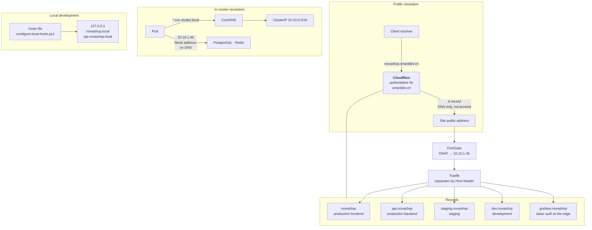
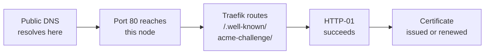

# DNS

How a name becomes an address, and why DNS is on the critical path for more than
reachability.



## The records

All five names resolve to the same public address. Separation happens at Traefik by
`Host` header, not in DNS.

| Name | Environment | Type |
|---|---|---|
| `novashop.smartdev.vn` | production frontend | A |
| `api.novashop.smartdev.vn` | production backend | A |
| `staging.novashop.smartdev.vn` | staging | A |
| `dev.novashop.smartdev.vn` | development | A |
| `grafana.novashop.smartdev.vn` | Grafana, basic auth at the edge | A |

## Records are DNS-only, not proxied

Cloudflare's proxy is deliberately off.

HTTP-01 validation requires Let's Encrypt to reach `/.well-known/acme-challenge/` on
**this** origin over port 80. With the proxy enabled, Cloudflare terminates TLS and
serves its own certificate, and the challenge path may not reach the origin
unmodified. Certificate issuance and renewal would fail in a way that looks like a
cert-manager problem.

Turning the proxy on is a legitimate future change — it would add caching and a WAF —
but it requires moving to DNS-01 validation first. That ordering is the point:
enabling the proxy without changing the challenge type breaks renewal silently, and
the failure surfaces up to sixty days later.

## DNS is on the certificate critical path

This is the part people miss. DNS is not only how visitors arrive; it is a hard
dependency of TLS renewal.



Every link is required. If DNS points elsewhere, no certificate can be issued or
renewed regardless of how healthy the cluster is — and nothing fails immediately,
because the existing certificate keeps working. The failure appears when renewal is
attempted, roughly 30 days before expiry.

That is exactly why [CertificateExpiring](../observability/runbooks/certificate-expiring.md)
fires at 21 days: cert-manager renews at about 30, so reaching 21 proves renewal has
already been failing for over a week.

It is also why `scripts/linux/recover.sh` treats public DNS as a **precondition**.
Recovering onto a node that the name no longer points at produces a cluster that
cannot obtain certificates, and finding that out at the end of a recovery is finding
it out too late.

## In-cluster resolution

CoreDNS serves `*.svc.cluster.local`. Grafana reaches its datasources this way:

```
http://novashop-prometheus-server.observability.svc.cluster.local
http://novashop-loki.observability.svc.cluster.local:3100
```

**PostgreSQL and Redis are addressed by literal IP**, `10.10.1.45`, because they run
on the host and are not Kubernetes Services — there is no cluster DNS name for them.
This is why their credentials carry an address rather than a hostname, and why
[DatabaseDown](../observability/runbooks/database-down.md) has to distinguish "the
service is down" from "it is not listening on the address pods use".

## Local development

`scripts/configure-local-hosts.ps1` maps `novashop.local` and `api.novashop.local` to
`127.0.0.1`. No public DNS is involved and no certificates are issued — local
development runs on HTTP. See the
[Local Development Guide](../operations/local-development.md).

## Verifying

```sh
dig +short novashop.smartdev.vn
dig +short api.novashop.smartdev.vn

# From outside the site, prove the whole chain including the ACME path
curl -sv http://novashop.smartdev.vn/.well-known/acme-challenge/probe 2>&1 | tail -20
curl -sI https://novashop.smartdev.vn
```

A 404 from the challenge path is the healthy answer — it proves the request reached
Traefik and was routed. A timeout means DNS or DNAT; a connection refused means the
node is reachable and nothing is listening.

More in [docs/networking/cloudflare.md](../networking/cloudflare.md) and
[docs/networking/verification.md](../networking/verification.md).

## Next

[TLS Flow](tls-flow.md).
