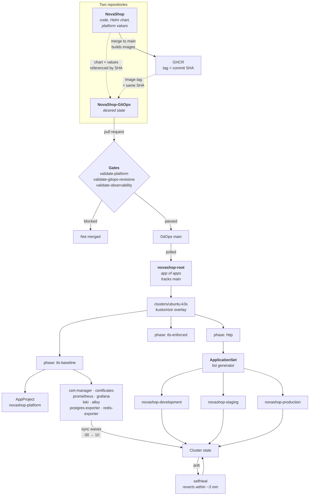

# GitOps Flow

How a commit becomes running state, and what stops the wrong commit from doing so.

## Two repositories, and why

Code and desired state are separate. The application repository can be built,
tested, and tagged without changing what the cluster runs; the GitOps repository
changes what runs without touching code. A single repository would make every image
build a potential deployment and every deployment a code change.

The cost is that a release takes two merges. That cost is the feature: the second
merge is where a human decides that a verified image should become live.

## Every reference is a commit SHA

`scripts/validate-gitops-revisions.sh` fails a pull request unless, for every
reference to the application repository:

- the `targetRevision` is a 40-character hexadecimal SHA — not `main`, not a tag;
- that SHA is an **ancestor of `origin/main`**, so a force-push cannot orphan what
  the cluster is pinned to;
- the backend and frontend image tags in one environment come from the **same**
  commit;
- no image tag is `latest`;
- both images actually **exist in GHCR**, checked with an anonymous token.

The last check is the one that earns its keep. A pin to a commit whose release
failed renders and validates perfectly and produces `ImagePullBackOff` on the
cluster.

The self-references are the deliberate exception: `novashop-root` and the
ApplicationSet's own repository track `main`. Pinning the root application to a SHA
would mean no GitOps change could ever take effect without editing the cluster.

## Phases, not a big bang

`clusters/ubuntu-k3s` is a Kustomize overlay composed of three phases:

| Phase | Contains | Why separate |
|---|---|---|
| `http` | ApplicationSet and the three environments | A fresh cluster serves traffic before any certificate exists |
| `tls-baseline` | AppProject, cert-manager, Certificates, the observability stack | Certificates are requested once the edge is reachable, so HTTP-01 can succeed |
| `tls-enforced` | Redirect and HSTS | Enforcement comes last, when there is something valid to enforce |

The ordering exists because of a rate limit. Let's Encrypt allows five duplicate
certificates per 168 hours. A bootstrap that demanded TLS before the edge was
reachable would fail validation, retry, and burn a week's budget in an afternoon.
Phasing makes the first attempt the one that succeeds.

## Sync waves

Within a phase, ordering is by wave, most negative first:

| Wave | What | Why there |
|---|---|---|
| `-30` | AppProject | Nothing can sync into a project that does not exist |
| `-20` | cert-manager | CRDs must exist before a `Certificate` is valid |
| `-15` | Prometheus | Ahead of what it observes, so a target appearing during a rollout is collected from its first moment |
| `-14` … `-12` | Grafana, Loki, Alloy, exporters | |
| `0` | Certificates | After cert-manager, before enforcement |
| `10` | Applications | |

## The AppProject is an enforcement boundary, not documentation

`novashop-platform` whitelists which resource kinds may be created. Argo CD enforces
it **at sync time**, which means a manifest can render cleanly, pass schema
validation, merge, and only then be refused. Loki's `StatefulSet` did exactly that.

The fix was not only to add the kind. `scripts/validate-observability.sh` now renders
every chart and fails the pull request if any rendered kind is absent from the
whitelist, moving the failure from after merge to before it.

## Self-heal, and the trap it sets

Every Application has `automated: {prune: true, selfHeal: true}`. A live edit is
reverted within about three minutes.

This is correct and it makes debugging counter-intuitive. A `kubectl patch` used to
test a hypothesis is reverted, usually before Argo CD has recomputed the comparison —
so the status you read afterwards reflects the *reverted* state, and an approach that
works looks like an approach that does nothing. That mistake cost two wrong fixes on
this platform. The procedure for testing against a live Application, including how to
pause root's self-heal and restore it, is in
[ArgoSyncFailed](../observability/runbooks/argo-sync-failed.md).

## Diffing correctly

Applications sync with `ServerSideApply=true`. The comparison that decides sync
status is a server-side apply **dry-run** against the live object — not the rendered
manifest against the live object.

`helm template | diff` is the natural instinct and it will report zero differences on
an Application that is permanently OutOfSync. The runbook gives the API calls to read
`predictedLiveState` against `normalizedLiveState`, which is the pair that actually
decides.

## Next

[CI/CD Flow](cicd-flow.md) — how the images referenced here come to exist.
