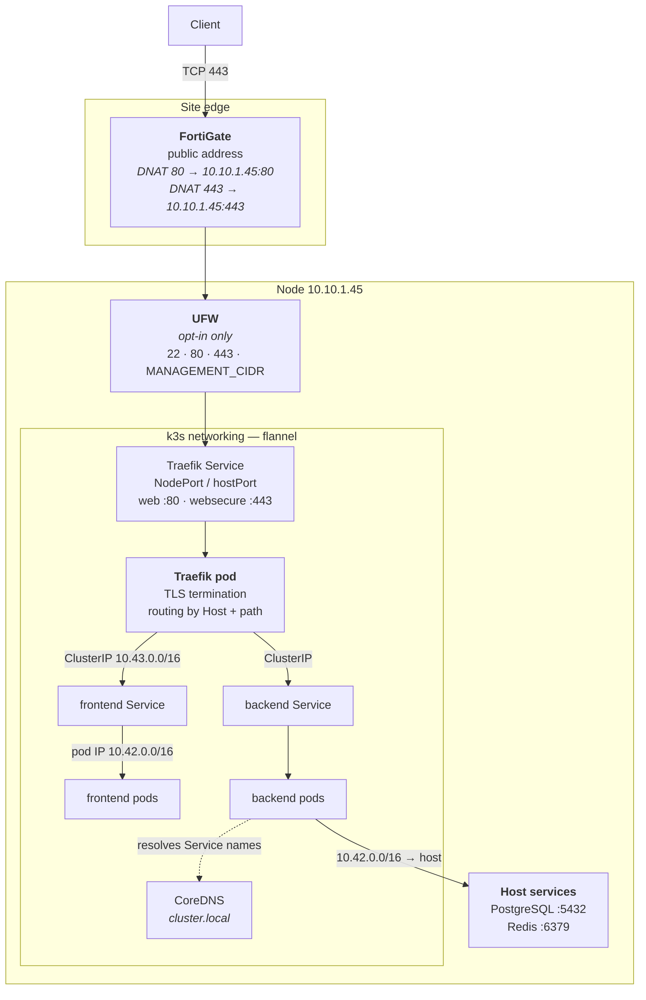

# Networking

How a packet from the internet reaches a pod, and every place it can be stopped.

## Address ranges

| Range | Role | Where it appears |
|---|---|---|
| `10.10.1.0/24` | LAN. Node is `10.10.1.45` | FortiGate DNAT target |
| `10.42.0.0/16` | Pod network (flannel) | `pg_hba.conf`, Redis `bind` |
| `10.43.0.0/16` | Service network (ClusterIP) | Grafana datasource URLs |
| `192.168.3.2` | Operator workstation | `MANAGEMENT_CIDR` |

## The firewall rule that must not be guessed

The operator's workstation is `192.168.3.2`, which is **not** inside `10.10.0.0/16`.

`scripts/linux/configure-datastores.sh` can enable UFW and it refuses to do so unless
`MANAGEMENT_CIDR` is set explicitly. A default of `10.10.0.0/16` would look reasonable,
match the node's own subnet, and lock the operator out of the only node in the platform
— with no second node to fix it from.

Enabling a firewall is the one bootstrap step where a sensible-looking default is worse
than refusing to act.

## Traefik routes on Host and path

Routing is by `Host` header, so all four names arrive on the same address and port and
are separated inside the cluster:

| Host | Routes to |
|---|---|
| `novashop.smartdev.vn` | production frontend |
| `api.novashop.smartdev.vn` | production backend |
| `staging.novashop.smartdev.vn` | staging frontend |
| `dev.novashop.smartdev.vn` | development frontend |

The `websecure` entrypoint is named explicitly on production Ingress objects via
`traefik.ingress.kubernetes.io/router.entrypoints`. Leaving it implicit means a rule can
end up bound to `web` only and serve plain HTTP without anything reporting an error.

Ingress baselines per environment live in `kubernetes/ingress/baseline/`.

## Pod-to-host traffic

The backend reaches PostgreSQL and Redis at `10.10.1.45` — the node's LAN address, not
`localhost`. From inside a pod, `localhost` is the pod.

Two configuration facts follow, both managed idempotently by
`configure-datastores.sh`:

- PostgreSQL `listen_addresses` must include `10.10.1.45`, not only `127.0.0.1`.
- `pg_hba.conf` needs `host all all 10.42.0.0/16 scram-sha-256`.
- Redis `bind` must include the LAN address, and `requirepass` is set from `REDIS_URL`.

An unauthenticated `redis-cli ping` returning `NOAUTH` is the healthy answer — it proves
Redis is reachable **and** protected. Reading that as a failure sends you looking in the
wrong place.

## Where a request can die

Working outward, which is also the order to check:

| Symptom | Layer | Runbook |
|---|---|---|
| DNS does not resolve | Cloudflare | [DNS](dns.md) |
| Resolves, connection times out | FortiGate DNAT, or UFW | this document |
| Connects, TLS fails | cert-manager or Traefik | [TLS Flow](tls-flow.md) |
| TLS fine, 404 | Traefik routing — Host or entrypoint | this document |
| 502 / 503 | No ready endpoint | [IngressErrors](../observability/runbooks/ingress-errors.md) |
| 504 | Backend accepted and did not answer | [HighLatency](../observability/runbooks/high-latency.md) |
| 500 | Application fault | [ApplicationErrorRate](../observability/runbooks/application-error-rate.md) |
| Backend unready | PostgreSQL or Redis unreachable | [DatabaseDown](../observability/runbooks/database-down.md) · [RedisDown](../observability/runbooks/redis-down.md) |

That table is the fastest diagnostic tool in this repository. The status code alone
narrows a whole-stack problem to one layer.

## Detail

- [docs/networking/traefik.md](../networking/traefik.md) — Traefik configuration
- [docs/networking/fortigate.md](../networking/fortigate.md) — NAT policy
- [docs/networking/cloudflare.md](../networking/cloudflare.md) — DNS records
- [docs/networking/public-access.md](../networking/public-access.md) — end to end
- [docs/networking/verification.md](../networking/verification.md) — proving it works

## Next

[DNS](dns.md).
