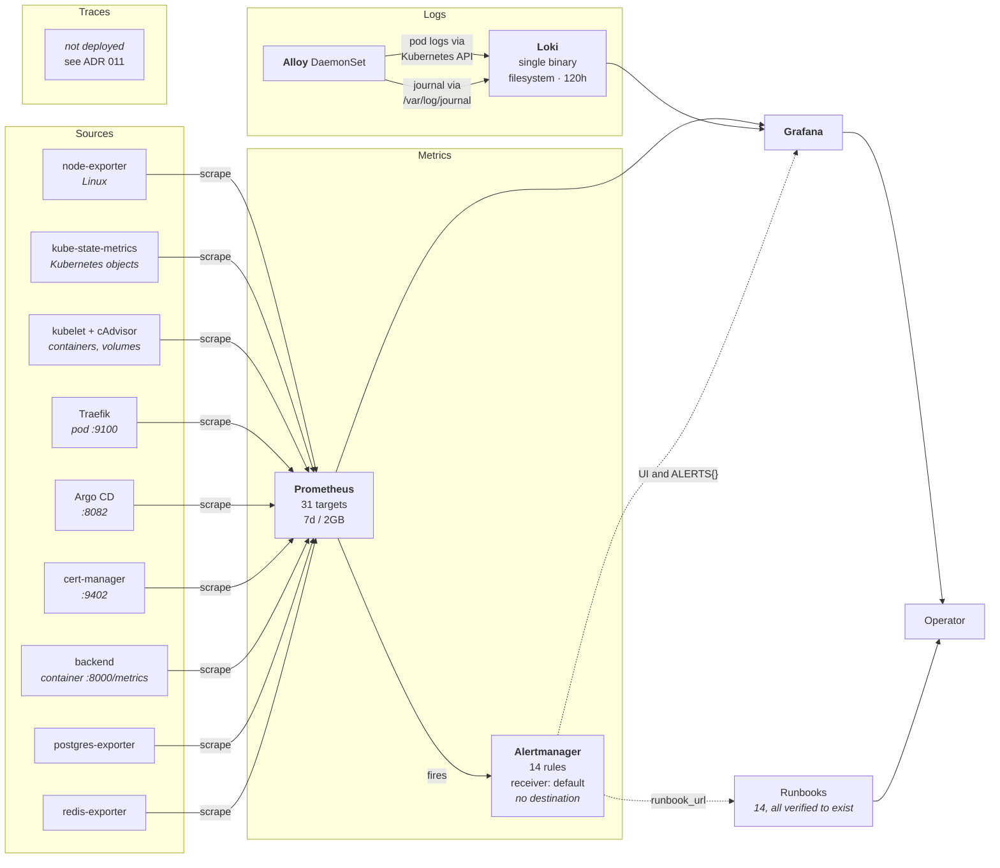

# Observability Flow

How metrics, logs, and alerts move, and where the gaps are.

## The failure mode this stack is designed against

A monitoring system fails in a way ordinary validation does not catch. A scrape job
whose relabel rules match nothing renders correctly, schema-validates correctly,
deploys correctly, and collects nothing — and the result is indistinguishable from a
healthy system with no problems to report.

Every unusual thing in this design is aimed at that.

**`validate-observability.sh` asserts required scrape jobs by name.** A job silently
disappearing from the rendered configuration is the regression the list exists to
catch.

**Traefik's discovery role is asserted explicitly.** Traefik publishes metrics on the
pod only; its Service exposes `web` and `websecure`. An endpoints-based job would be
valid and collect zero series, so the gate requires `role: pod`.

**Alert expressions are evaluated against live data before merge.** Not to see them
fire — most should not — but to confirm their label selectors match real series. An
alert built on a mistyped label name parses, renders, deploys, and never fires. Doing
this caught that the edge rules needed pinning to `job="traefik"`.

**Every alert's runbook is resolved to a file.** The gate reads the rendered rules and
fails if a `runbook_url` points at a document nobody wrote — otherwise it is discovered
by whoever is following the link during an incident.

## Metrics

Prometheus scrapes 31 targets across nine sources. Retention is 7 days **and** 2GB on
a 3Gi volume — a size cap as well as a time cap, because on a single shared disk time
alone does not bound anything.

Discovery is annotation-based for exporters plus explicit jobs for the platform
components. Two details are load-bearing:

- The `argocd` job **drops `argocd-dex-server`**, which does not serve metrics.
- The backend's annotation names the **container** port. Endpoints-role discovery
  connects to the pod IP, so naming the Service port produces connection refused on
  every replica — which it did, silently, across six production pods.

**Known duplication.** Traefik is scraped twice: by the dedicated `traefik` job and
again by the chart's default annotation-based `kubernetes-pods` job, because the
Traefik pod carries its own `prometheus.io` annotations. Seven duplicate series. A
ratio is unharmed, but the edge alerts pin `job="traefik"` rather than relying on the
arithmetic working out. Removing the duplicate means overriding a chart default scrape
job and is on the [roadmap](../../docs/ROADMAP.md).

## Logs

Alloy replaces both Promtail and the OpenTelemetry Collector from the original scope —
**one fewer technology, not one more**. Promtail reached end of life in March 2026, and
Alloy performs both roles. The reasoning is in
[ADR 004](../../adr/004-log-collection-agent.md).

Container logs are read through the Kubernetes API rather than host paths, so the agent
needs no hostPath mount for them and cannot read outside its RBAC. The journal is the
exception.

Labels are kept low cardinality on purpose: `namespace`, `pod`, `container`, `app`,
`component`, `source`, `cluster`. Anything derived from a request, a trace ID, or a
user identifier belongs in the log line — every distinct label combination is a
separate stream, and one high-cardinality label fills a 2Gi volume in hours.

Journal fields need a **relabel rule**, not a `stage.labels`. Journal metadata arrives
as internal `__journal_*` labels, and `stage.labels` promotes from the extracted map,
which is empty for journal input. An earlier revision used it and produced journal
streams with no `unit` label at all, making filtering by systemd unit impossible.

## Alerting

Fourteen rules across seven groups. Thirteen were the original scope;
`ObservabilityVolumeFilling` was added because every other alert depends on Prometheus
having somewhere to write — without it, the one failure that blinds the whole stack is
the one nothing watches.

Grouping is by `alertname` and `namespace`, so one fault across six replicas is one
notification. `repeat_interval` is twelve hours; anything shorter trains people to mute
the channel. Two inhibition rules suppress derived noise, including `NodeDown`
suppressing everything else for that instance — a down node also breaches CPU, memory,
and disk, and reporting all four points at the wrong problem three times.

**Notification routing is intentionally absent.** Alertmanager has one receiver with no
destination. Delivering to Slack or PagerDuty needs a credential this repository does
not hold and a decision about who is on call, and neither belongs in an unreviewed
default. Alerts still evaluate, appear in the UI, and are queryable as
`ALERTS{alertstate="firing"}`. [docs/observability/alerts.md](../observability/alerts.md)
gives the exact change to add a destination.

## Traces

**Not deployed.** The instrumentation exists in
`backend/app/observability/tracing.py` and is disabled unless
`OTEL_EXPORTER_OTLP_ENDPOINT` is set. No collector runs.

The honest reason: the backend has no business endpoints and the frontend calls it from
the browser, so a trace today would contain `GET /ready`, one `asyncpg` query, and one
Redis `PING`. That demonstrates plumbing, not tracing. Deploying it would add a
component whose dashboards would be empty of anything meaningful.

Recorded in [ADR 011](../../adr/011-distributed-tracing.md), including what would have
to be true for it to be worth deploying.

## Dashboards

Provisioned from ConfigMaps carrying the `grafana_dashboard` label, so each dashboard
is a reviewable file rather than a database row that vanishes with the volume. Nothing
is created through the UI.

## Guide

[Observability Guide](../operations/observability-guide.md) for daily use;
[docs/observability/architecture.md](../observability/architecture.md) for component
detail.

## Next

[Networking](networking.md).
