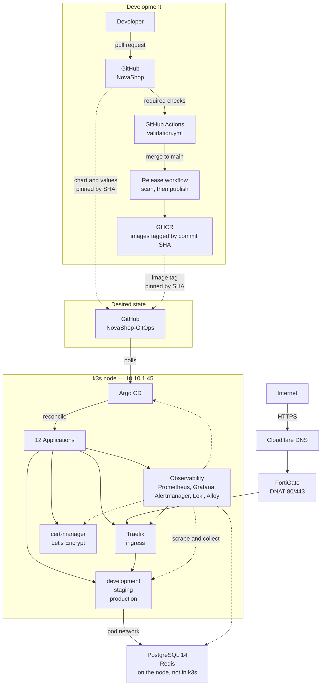

# Architecture Overview

NovaShop is a two-tier web application used as the payload for a
production-grade platform. The application is deliberately small. The platform
around it — GitOps delivery, progressive TLS enforcement, guardrails that block
unsafe releases, observability with runbook-backed alerting, and verified disaster
recovery — is the subject.

## The shape of it

## The five subsystems

**Delivery.** A pull request runs five validation jobs. Merging to `main` runs the
same reusable workflow again inside the release job graph, then builds, scans, and
only then pushes. An image cannot reach the registry unless its scan passed, and
`latest` moves only after the whole matrix succeeds. See
[CI/CD Flow](cicd-flow.md).

**Desired state.** A second repository holds what the cluster should be running.
Every reference to the application repository is a 40-character commit SHA, verified
by a gate to be an ancestor of `main` and to correspond to images that exist in the
registry. Nothing tracks a branch, so nothing changes underneath the cluster. See
[GitOps Flow](gitops-flow.md).

**Edge.** Traefik terminates TLS with certificates cert-manager obtains from Let's
Encrypt over HTTP-01. TLS is introduced in phases so that a fresh cluster is never
blocked on certificate issuance, and rollback preserves TLS rather than reverting to
plain HTTP. See [TLS Flow](tls-flow.md) and [Networking](networking.md).

**Runtime.** Three environments — development, staging, production — from one Helm
chart and three values files, generated by an ApplicationSet. PostgreSQL and Redis
run on the node itself rather than in the cluster. See
[Container Diagram](c4-container.md).

**Observability.** Prometheus scrapes 31 targets. Loki holds logs shipped by an
Alloy DaemonSet. Fourteen alert rules each carry a link to a runbook that a gate
proves exists. See [Observability Flow](observability-flow.md).

## The constraints that shaped it

Every non-obvious decision in this platform traces back to one of these. They are
stated here because a design looks arbitrary until you know what it was fighting.

| Constraint | Consequence |
|---|---|
| **One node** | No rescheduling. A node fault is a total outage, so recovery is a documented, tested procedure rather than an assumption about redundancy. |
| **k3s with SQLite** | No etcd. Backup is a file, not an etcd snapshot, which makes the recovery path simpler and the write path a single point of failure. |
| **`local-path` is the only storage class** | Volumes are node-local. A `PersistentVolumeClaim` cannot outlive the node, so persistent data that matters is either backed up or accepted as disposable. |
| **Let's Encrypt rate limits** | Five duplicate certificates per 168 hours. Certificate issuance cannot be part of a loop that retries, which is why TLS is phased and why the runbook forbids deleting a Certificate to "force a retry". |
| **Memory limits at ~150% of allocatable** | Deliberate overcommit. Every workload declares requests and limits — a gate enforces it — and an alert watches for the point where overcommit stops being free. |
| **PostgreSQL and Redis outside the cluster** | Reached over the pod network, so their reachability alert covers three distinct faults that look identical from inside k3s. |

## What this platform is not

It is not highly available. It is one node, and every document says so.

It does not run production traffic for anyone. The environments are named
development, staging, and production because the delivery pipeline needs to
demonstrate promotion between them, not because a business depends on the third.

It does not have distributed tracing. See
[ADR 011](../../adr/011-distributed-tracing.md).

## Where to go next

- [System Context](c4-system-context.md) for the boundary and external dependencies
- [Architecture Decision Records](../../adr/) for why each technology, and what lost
- [Operations](../operations/) for how to run it
