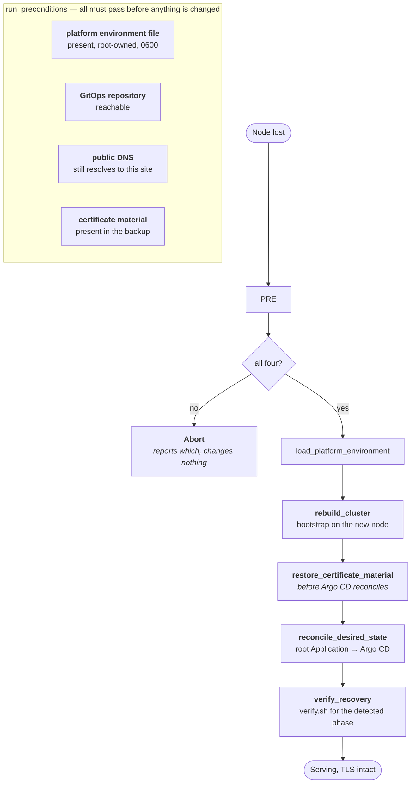

# Recovery Flow

Rebuilding the platform on a replacement node, with existing DNS and existing
certificates.

## Preconditions run first, and change nothing

`run_preconditions` checks all four conditions and reports every failure before the
script touches the machine. It does not check one, act, then check the next.

The reason is the shape of a recovery. The operator is under pressure and the node is
already broken; a script that gets halfway and stops has produced a third state that
is neither the old one nor the new one, and now has to be diagnosed too. Checking
everything first means the answer is either "proceed" or "here is what is missing",
and the machine is untouched in the second case.

## Certificates are restored before Argo CD reconciles

This is the ordering that matters most, and it exists because of a rate limit.

Let's Encrypt allows **five duplicate certificates per 168 hours**. If Argo CD
reconciles first, cert-manager finds no certificate Secret, requests a new one, and
spends one of five. A recovery rehearsed three times in a week — which is exactly what
a recovery procedure *should* be — exhausts the budget and leaves the platform unable
to obtain a certificate at all, for days, with no way to hurry it.

So `restore_certificate_material` runs before `reconcile_desired_state`. cert-manager
then finds a valid certificate, sees nothing to do, and the recovery costs zero
issuances.

## DNS is a precondition, not a step

`check_public_dns` verifies the name still resolves to this site. Recovery does not
change DNS, and it fails early if DNS is wrong rather than proceeding to a state where
HTTP-01 validation cannot possibly succeed.

The dependency is worth spelling out: HTTP-01 requires the public name to reach this
node on port 80. If DNS points elsewhere, certificates cannot be issued or renewed no
matter how healthy the cluster is.

## Backup and restore

| Script | Captures / restores |
|---|---|
| `scripts/backup-platform-state.sh` | Certificate Secrets and the ACME account key. **Kubernetes Secrets only** |
| `scripts/backup-datastores.sh` | PostgreSQL dump and an online copy of the k3s SQLite datastore |
| `scripts/verify-backup.sh` | Proves a backup set is readable, without restoring it |
| `scripts/restore-datastores.sh` | PostgreSQL and SQLite, onto a prepared node |
| `scripts/restore-platform-state.sh` | Certificate Secrets, onto a prepared node |
| `scripts/linux/recover.sh` | Orchestrates the sequence above |

An earlier version of this table claimed `backup-platform-state.sh` captured the SQLite
datastore and the runtime environment. It did not, and never had — it exports Kubernetes
Secrets. `backup-datastores.sh` exists because of that gap.

Captured state is treated as sensitive. `.gitignore` blocks `tls-*.json`,
`acme-*.json`, `runtime-*.json`, and `platform-state*/`, because a backup of this
platform contains certificate private keys and datastore credentials.

## What recovery restores, and what it does not

| Restored | Accepted as lost |
|---|---|
| Cluster state and all Applications | Prometheus metric history |
| TLS certificates and ACME account | Loki log history |
| Datastore credentials | Alertmanager silences |
| Application data in PostgreSQL | |

Prometheus, Loki, and Alertmanager volumes are `local-path` — node-local by
definition, and not in the backup. This is a deliberate choice rather than an
oversight: their contents are observational, bounded by retention anyway, and
excluding them keeps the backup small enough that taking one is not a decision.

## Rollback is not recovery

Recovery rebuilds a lost node. Rollback moves a working platform back to a previous
state, and it has its own hazard: the naive version reverts the edge to plain HTTP,
which browsers that have seen HSTS will refuse to load.

The platform's rollback unwinds TLS enforcement properly, serving `max-age=0` so
browsers release the HSTS pin, rather than dropping to HTTP and leaving visitors with
an error they cannot click through. See
[docs/recovery/disaster-recovery.md](../recovery/disaster-recovery.md).

## Verification

`verify_recovery` calls `verify.sh`, which asserts against the **detected** edge phase
rather than an assumed one. A recovery that lands in the `baseline` phase is verified
as `baseline`; it is not marked failed for lacking HSTS it was never supposed to have
yet.

## Rehearsal

A recovery procedure that has never been run is a document, not a capability. The
checklist and the evidence from running it are in
[docs/recovery/disaster-recovery.md](../recovery/disaster-recovery.md).

## Next

[Observability Flow](observability-flow.md).
