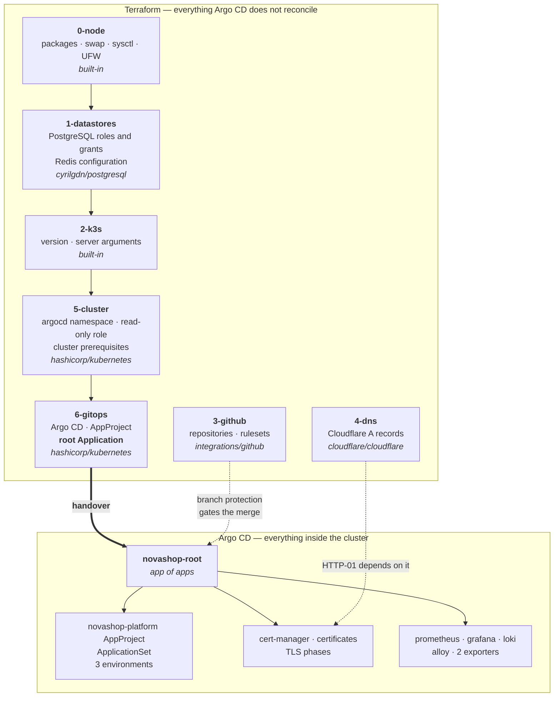

# Terraform Flow

How the platform is codified outside the cluster, and exactly where Terraform stops.



## The boundary

**Terraform owns what Argo CD does not reconcile. Nothing else.**

Every Application has `selfHeal: true`, so a Terraform-managed object that Argo CD also
reconciles is reverted within about three minutes and `terraform plan` never converges. This
is a functional constraint, not a stylistic preference — see
[ADR 013](../../adr/013-terraform-kubernetes-boundary.md).

Twice, checking the cluster rather than reasoning about it changed the design:

**Three namespaces look unowned and are not.** `novashop-development`, `-staging`, and
`-production` carry no Argo CD tracking annotation, so `kubectl get namespace -o yaml` shows
nothing. `managedNamespaceMetadata` on the ApplicationSet reapplies their labels every sync.
Terraform declaring them would have produced permanent drift on the namespaces holding every
application environment.

**The root Application cannot be a `kubernetes_manifest`.** That resource type does not
support import, and the object already exists. Declaring it plans a create, the create fails
on conflict, and deleting first cascades — the Application carries
`resources-finalizer.argocd.argoproj.io`.

## What each layer owns

| Layer | Owns | Asserts |
|---|---|---|
| `0-node` | packages, swap, sysctl, UFW | UFW is never enabled without an explicit `management_cidr` |
| `1-datastores` | PostgreSQL roles, grants, databases; Redis config | the exporter cannot create objects; Redis is reachable from pods |
| `2-k3s` | version, server arguments | Traefik is not disabled |
| `3-github` | two repositories, rulesets, Dependabot | every required check maps to a managed repository |
| `4-dns` | four Cloudflare A records | `proxied` is false; at least one name answers HTTP-01 |
| `5-cluster` | the `argocd` namespace, a read-only ClusterRole | `local-path` is default and binds late; one node; version floor; Pod Security posture |
| `6-gitops` | Argo CD, `novashop` AppProject, root Application, repository registration | the root Application tracks the right repository, revision, path, project, with `selfHeal` and `prune` |

Layers `0`–`4` currently declare their interface and manage nothing; resources land in later
phases. See the [Terraform audit](../TERRAFORM_AUDIT.md).

## State

Each layer is a separate root module with its own state and its own schema, so a mistaken
`destroy` cannot cross a boundary.

The backend is **PostgreSQL** — the instance already on the node, already in the platform
backup, and the `pg` backend gives real state locking. No cloud account exists and no new
infrastructure is added.

The ordering cost is real: PostgreSQL must exist before Terraform can store state. Layers that
run before the node does — GitHub and DNS during a rebuild — start on local state via an
override file and migrate afterwards. In recovery, **PostgreSQL is restored before Terraform
runs at all**, which is the same principle as restoring certificates before Argo CD
reconciles.

## Import, never create

Every resource on this platform already exists. Recreating a DNS record is an outage;
recreating a ruleset is a window with no branch protection; recreating the root Application
cascades.

So each layer lands with `import` blocks and an acceptance gate of an **empty plan**:

```
Plan: 1 to import, 1 to add, 0 to change, 0 to destroy.
```

Anything under "to change" means the configuration does not match reality, and applying it
would edit reality to match a mistaken description. Getting `5-cluster` to that gate took two
attempts — the namespace carried a `sync-wave` annotation that had to be declared, and
`kubernetes.io/metadata.name` had to *not* be, because the API server sets it and the provider
does not return it.

## Secrets

Terraform manages no Secret that contains a credential, and does not read one either — the
provider returns the whole object, so a data source is as revealing as an import, and either
would place values in state as plaintext.

The one exception is repository registration, and it is enforced rather than trusted: both
repositories are public, so the Secret holds a URL and a type. A `check` block refuses
credential keys and a variable validation refuses `ssh://` URLs.

Everything else stays where [ADR 010](../../adr/010-secret-management.md) put it:
`/root/.novashop-platform.env` at 0600, root-owned.

## Validation

Runs without credentials and without a backend, which is what lets it run on a fork:

```sh
terraform fmt -check -recursive terraform
cd terraform/layers/<layer> && terraform init -backend=false && terraform validate
```

CI runs both plus `tflint` across every layer. `plan` is not automated — it needs cluster and
provider credentials — and **`apply` never will be.** On a single-node platform where
Terraform holds DNS and the cluster seed, an automatic apply is a blast radius out of
proportion to the convenience.

## Related

- [ADR 012](../../adr/012-terraform-scope.md) — why Terraform, and what it does not manage
- [ADR 013](../../adr/013-terraform-kubernetes-boundary.md) — the Kubernetes boundary
- [ADR 014](../../adr/014-terraform-gitops-handover.md) — the handover
- [Terraform audit](../TERRAFORM_AUDIT.md) — findings and maturity score
- [Bootstrap Flow](bootstrap-flow.md) · [GitOps Flow](gitops-flow.md)
