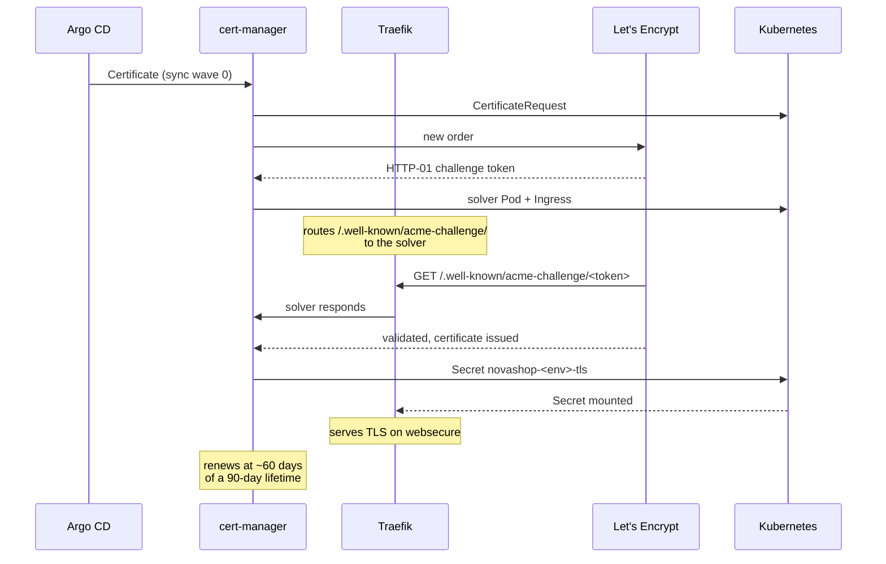
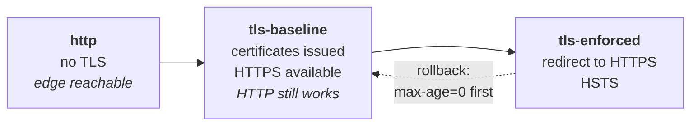

# TLS Flow

How a certificate comes to exist, how it stays valid, and why enforcement arrives
last.



## The three phases, and why enforcement is last



| Phase | State | Why it exists |
|---|---|---|
| `http` | Plain HTTP | HTTP-01 needs port 80 to reach this node. A cluster that demands TLS before the edge is reachable cannot obtain the certificate it is demanding. |
| `tls-baseline` | HTTPS available, HTTP still served | The certificate exists and is proven working before anything depends on it. |
| `tls-enforced` | Redirect plus HSTS | Enforcement applies once there is something valid to enforce. |

The phase is **detected** from live cluster state by
`scripts/lib/edge-phase.sh`, never assumed, and `verify.sh` asserts the properties
appropriate to the detected phase. Asserting HSTS in the `http` phase would fail
correctly and teach nothing.

## The rate limit is the reason for all of this

Let's Encrypt production allows **five duplicate certificates per 168 hours**.

That single number explains the phased design, the recovery ordering, and a firm
instruction in the runbook. Certificate issuance cannot be inside anything that
retries. A bootstrap loop that requests a certificate, fails validation, and tries
again will exhaust a week's budget in an afternoon and leave the platform unable to
obtain a certificate at all — with no way to hurry it.

Three consequences:

1. **Bootstrap** reaches `tls-baseline` only once the edge is reachable, so the first
   attempt is the one that succeeds.
2. **Recovery** restores certificate material *before* Argo CD reconciles, so
   cert-manager finds a valid certificate and requests nothing. A recovery rehearsed
   three times in a week costs zero issuances.
3. **The runbook forbids** deleting a Certificate to force a retry. It feels like a
   reset and it spends one of five. Fix the validation failure instead, and debug
   against Let's Encrypt **staging** if the budget is already gone.

## HSTS makes rollback dangerous

HSTS tells a browser to refuse plain HTTP for this host for `max-age` seconds. Once a
visitor has seen the header, reverting the edge to HTTP does not degrade gracefully —
their browser refuses to connect, and there is no button to click through.

So rolling back out of `tls-enforced` serves `max-age=0` first, letting browsers
release the pin, and only then removes HTTPS. The naive rollback — delete the TLS
configuration, serve HTTP — leaves every previous visitor unable to reach the site.

This is the difference between a rollback that works and one that only works for
people who have never visited.

## Renewal, and why it fails silently

cert-manager renews at roughly two thirds of a 90-day lifetime, so a healthy
certificate should never drop below about 30 days remaining.

Renewal failure produces **no immediate symptom**. The existing certificate keeps
working, the site keeps serving, and nothing is unhealthy until expiry. That is why
`CertificateExpiring` fires at **21 days**: late enough to be unambiguous, early enough
to leave three weeks, and past the point where a healthy platform could ever be.

The renewal chain is the same as the issuance chain, so it depends on public DNS
continuing to point here — see [DNS](dns.md).

## Certificates in use

| Secret | Namespace | Names |
|---|---|---|
| `novashop-production-tls` | `novashop-production` | `novashop.smartdev.vn`, `api.novashop.smartdev.vn` |
| `novashop-staging-tls` | `novashop-staging` | `staging.novashop.smartdev.vn` |
| `novashop-development-tls` | `novashop-development` | `dev.novashop.smartdev.vn` |

Issuer is a `ClusterIssuer` named `letsencrypt-production`, ACME HTTP-01.

## One open item

**Cloudflare proxy stays off.** Enabling it requires moving to DNS-01 first, or
HTTP-01 validation breaks silently. See [DNS](dns.md).

## Verifying

```sh
sudo k3s kubectl get certificates -A
sudo k3s kubectl get challenges -A          # empty is healthy
curl -sI https://novashop.smartdev.vn | grep -i strict-transport-security
```

```promql
(certmanager_certificate_expiration_timestamp_seconds - time()) / 86400
```

Expect close to 90 after a renewal, never below 30 on a healthy platform.

## Detail

- [docs/security/tls.md](../security/tls.md)
- [docs/networking/ssl-renewal.md](../networking/ssl-renewal.md)
- [CertificateExpiring runbook](../observability/runbooks/certificate-expiring.md)

## Back to

[Architecture index](README.md).
