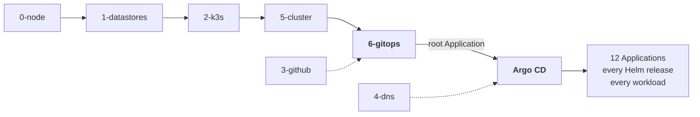

# Layer 6 — GitOps bootstrap

The handover. Terraform prepares the cluster; after this layer, Argo CD reconciles
everything.

This is the last layer Terraform runs. Once the root Application exists and points at the
GitOps repository, Terraform has no further part in what runs inside the cluster.



## What it owns

| Object | Why Terraform can own it |
|---|---|
| Argo CD installation — version and digest | Argo CD does not install itself |
| `novashop` AppProject | Applied by `scripts/bootstrap.sh`; **no tracking annotation**, so Argo CD does not reconcile it |
| `novashop-root` Application | Same. It is the app-of-apps and nothing reconciles it |
| Repository registration Secrets | New. Safe **only because both repositories are public** |

`novashop-platform` AppProject and the `novashop` ApplicationSet are *not* here — both carry
`tracking-id: novashop-root:...`, so Argo CD reconciles them. See
[ADR 013](../../../adr/013-terraform-kubernetes-boundary.md).

## Why the installer stays a script

`terraform_data` with a content-hash trigger, executing `install-argocd.sh` over SSH.

The script applies a large multi-document manifest, waits for three CRDs to become
`Established`, waits for every Deployment to become `Available`, and waits on a StatefulSet
rollout. Terraform cannot express "wait for a CRD to be Established" and would have to poll
from a provisioner anyway — so reimplementing it in HCL would be a rewrite of working code
into a worse form.

What Terraform contributes is the part the script was weakest at: **the version and its
digest become declarative inputs with validation**, hashed together so that changing the
version without updating the digest is a visible difference rather than a silently
mismatched pin.

## Why the AppProject and root Application are not `kubernetes_manifest`

`kubernetes_manifest` **does not support import**, and both objects already exist.

Declaring them would plan a create; the create would fail on a conflict; and the only way
through would be to delete them first. For an Application carrying
`resources-finalizer.argocd.argoproj.io`, deletion cascades to everything it manages —
which is the entire platform.

So they follow the same pattern as the installer: manifests on disk, Terraform owning the
inputs and the trigger. What Terraform adds is validation of the result, below.

## What it validates

Seven `check` blocks, all reading the **live** root Application rather than the manifest on
disk — because the question worth answering is what the cluster is actually following.

| Assertion | Why |
|---|---|
| Tracks the GitOps repository | Everything descends from this object; the wrong repository means the whole platform reconciles from somewhere unintended |
| Tracks `main` | One of only two references deliberately **not** pinned to a SHA. Pinning it means no GitOps change can ever take effect |
| Renders `clusters/ubuntu-k3s` | A different path is a different set of phases, and therefore a different cluster |
| Belongs to the `novashop` project | |
| `selfHeal` **and** `prune` are true | Without both, the platform stops being GitOps: it deploys once and drifts freely |
| Registered repositories are in the project's `sourceRepos` | Argo CD refuses a non-whitelisted source **at sync time** — renders, validates, merges, then fails |
| Running Argo CD matches the declared version | A mismatch means the installer did not run, or the cluster was upgraded outside Terraform, and the pinned digest no longer describes what is installed |

All seven were negative-tested against the live cluster. Each fires and names the observed
value.

## Repository registration, and the one exception to the Secret rule

Terraform does not manage Secrets on this platform — state stores values in plaintext, and
`/root/.novashop-platform.env` at 0600 is stronger. See
[ADR 010](../../../adr/010-secret-management.md).

These are the exception, for one specific reason: **both repositories are public**, so the
Secret holds a `url`, a `type`, and a `name`, and no credential. A repository Secret for a
private repository would carry a token or an SSH key, and that would put it in state.

The exception is enforced, not trusted. A `check` block refuses any Secret declaring
`password`, `sshPrivateKey`, `tlsClientCertKey`, `githubAppPrivateKey`, or `bearerToken`, and
a variable validation refuses an `ssh://` URL because it implies a deploy key.

**No `project` field.** Scoping a repository to a project restricts every *other* project
from using it, which would break the `novashop-platform` Applications rendering from the same
repositories. Unscoped matches the behaviour today: anonymous clone, available to all.

## `run_bootstrap` defaults to false

On an already-bootstrapped cluster there is nothing to install, and the scripts wait for
Deployments and rollouts — a long no-op that surprises whoever ran `terraform apply`
expecting a quick change.

Set it true on a fresh node or during recovery, which is where this layer earns its place.
With it false, the layer is registration plus validation, which is what you want on a running
platform.

## Running it

`plan` needs a reachable cluster: this layer reads the live root Application to validate the
handover it performs.

```sh
export TF_VAR_ssh_private_key="$(cat ~/.ssh/novashop)"
cp ../../examples/backend-local-override.tf.example backend_override.tf
cp ../../examples/6-gitops.tfvars.example terraform.tfvars

terraform init
terraform plan
```

On the platform as it stands:

```
Plan: 2 to add, 0 to change, 0 to destroy.
```

Two repository Secrets, and nothing else. Every assertion silent.

## Recovery

This layer is the reason a rebuild is short. The full sequence is in
[disaster-recovery.md](../../../docs/recovery/disaster-recovery.md); the Terraform part is:

```sh
# Preconditions first — recover.sh checks all four before changing anything.
cd terraform/layers/0-node       && terraform apply
cd ../1-datastores               && terraform apply
cd ../2-k3s                      && terraform apply
cd ../5-cluster                  && terraform apply
cd ../6-gitops                   && terraform apply -var run_bootstrap=true
```

Then stop. Argo CD reconciles the remaining twelve Applications from Git on its own, and
`verify.sh` asserts the result against the edge phase it detects.

Two orderings that are not negotiable:

**PostgreSQL is restored before Terraform runs at all**, because the `pg` backend lives in
it. The same principle as restoring certificates before Argo CD reconciles.

**Certificate material is restored before this layer runs.** If Argo CD reconciles first,
cert-manager finds no certificate Secret and requests a new one — spending one of five
duplicate certificates per 168 hours. A recovery rehearsed three times in a week would
exhaust the budget and leave the platform unable to obtain a certificate for days.

## Verification after apply

```sh
terraform output -json verification_commands | jq -r '.[]'
```

Renders the four commands that prove the handover is intact, so `verify.sh` asserts them
rather than a person remembering to look.
